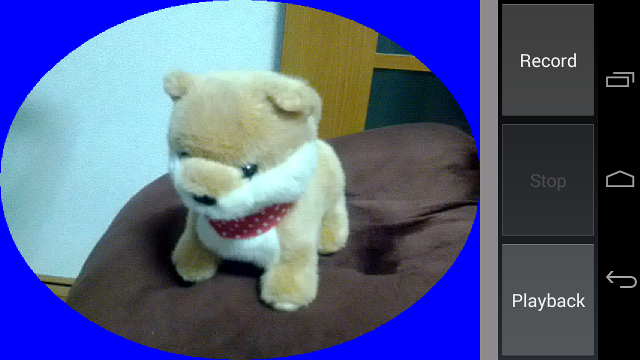
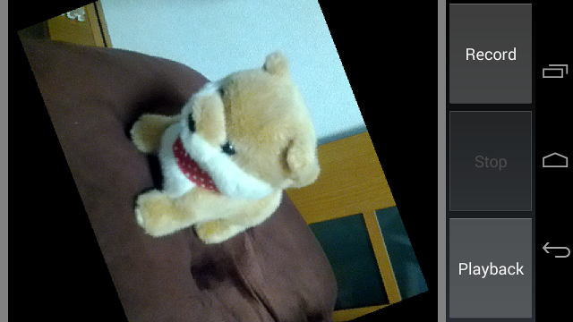

Android - MediaCodecTest
========================

MediaCodec API sample app. (Video recording with effect)  

API 16 (Android 4.1)
====================

./MediaCodecTest16/...  

**Keyword**  
MediaCodec,  
Camera, SurfaceView, YUV/RGB, NDK/JNI,,,  

API 18 (Android 4.3)
====================

./MediaCodecTest18/...  

**Keyword**  
MediaCodec, MediaMuxer, SurfaceTexture,  
Camera, GLSurfaceView, OpenGL ES, FBO,,,  

Screen shot
===========

Link
====

* [Android MediaCodec stuff](http://bigflake.com/mediacodec/)  
* [Android 4.3 APIs | Android Developers](http://developer.android.com/about/versions/android-4.3.html)  
* [MediaCodec | Android Developers](http://developer.android.com/reference/android/media/MediaCodec.html)  

License
=======

Copyright (C) 2013 MorihiroSoft  
Copyright 2013 Google Inc. All Rights Reserved.  

Licensed under the Apache License, Version 2.0 (the "License");
you may not use this file except in compliance with the License.
You may obtain a copy of the License at

<http://www.apache.org/licenses/LICENSE-2.0>

Unless required by applicable law or agreed to in writing, software
distributed under the License is distributed on an "AS IS" BASIS,
WITHOUT WARRANTIES OR CONDITIONS OF ANY KIND, either express or implied.
See the License for the specific language governing permissions and
limitations under the License.
